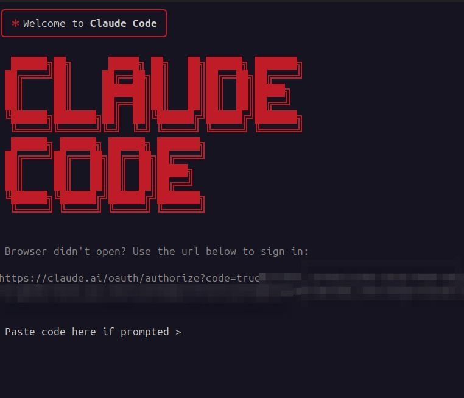

# Claude Container

A Docker container with Claude Code pre-installed and ready to use. This container includes all necessary dependencies and provides an easy way to run Claude Code in an isolated environment.

## Docker Hub

Images available on Docker Hub: [nezhar/claude-container](https://hub.docker.com/r/nezhar/claude-container)

## Compatibility Matrix

| Container Version | Claude Code Version |
|-------------------|---------------------|
| 1.0.x             | 1.0.x               |
| 1.1.x             | 2.0.x               |

## Quick Start

### Using Docker Compose

Create a `compose.yml` file as provided in the example folder.

```bash
export UID GID=$(id -g)
docker compose run claude-code claude
```

You will need to login for the first time, afterwards your credentials and configurations will be stored inside a bind mount volume, make sure this stays in your `.gitignore`.

### Using Docker directly


```bash
docker run --rm -it -v "$(pwd):/workspace" -v "$HOME/.config/claude-container:/claude" -e "CLAUDE_CONFIG_DIR=/claude" nezhar/claude-container:latest claude
```

This will store the credentials in `$HOME/.config/claude-container` and will be able to reuse them after the first login.

## How does the authentication work

You will be prompted by Claude Code to authorize. If you have a Claude subscription and you choose the first login option you will receive a login link for the authorization. After following the link you will receive a token that you need to paste into your terminal and you are ready to go.



## Integration with Existing Projects

To integrate Claude Code into an existing Docker Compose project, create a `compose.override.yml` file:

```yaml
services:
  claude-code:
    image: nezhar/claude-container:latest
    user: "${UID:-1000}:${GID:-1000}"
    volumes:
      - ./workspace:/workspace
      - ./claude-config:/claude
    ports:
      - "3001:3001"
    environment:
      CLAUDE_CONFIG_DIR: /claude
    profiles:
      - tools
```

Then run Claude Code with:

```bash
# Using profiles to avoid starting by default
export UID GID=$(id -g)
docker compose --profile tools run claude-code claude
```

This approach keeps Claude Code separate from your main application services while allowing easy access when needed.
