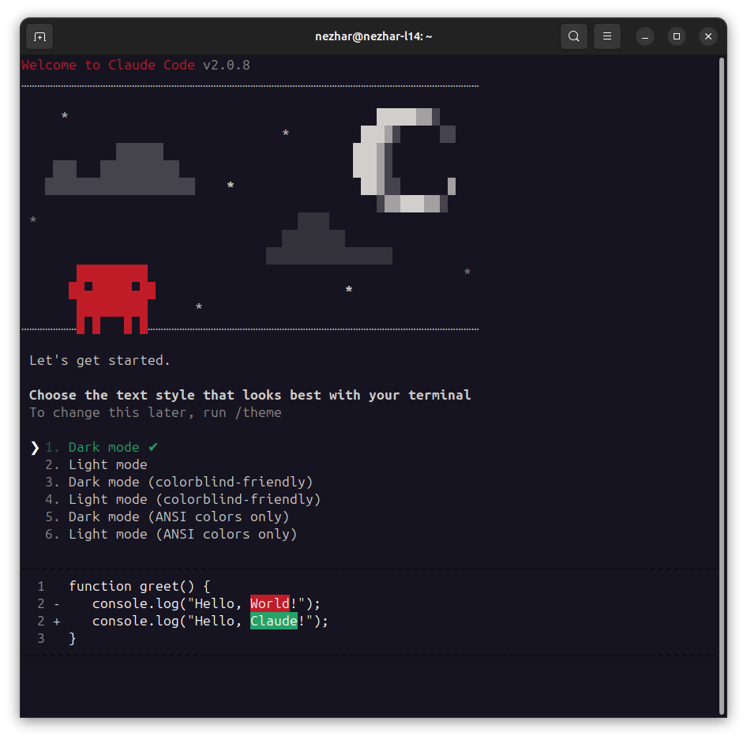
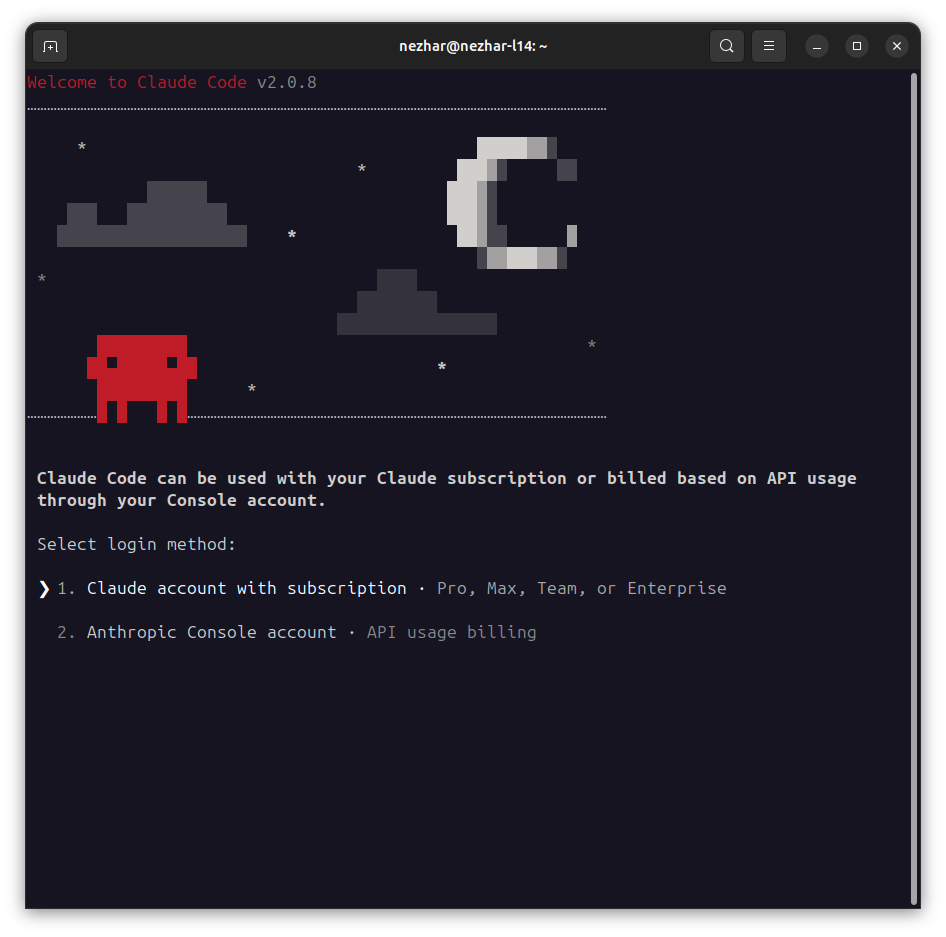
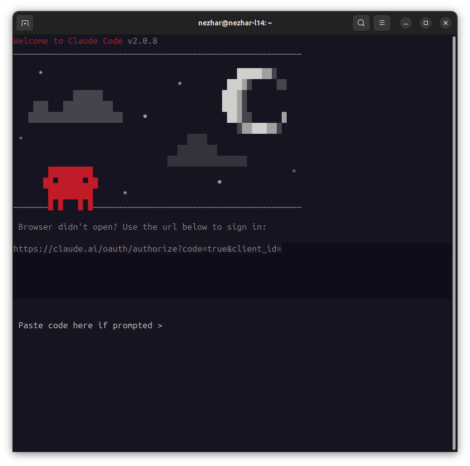
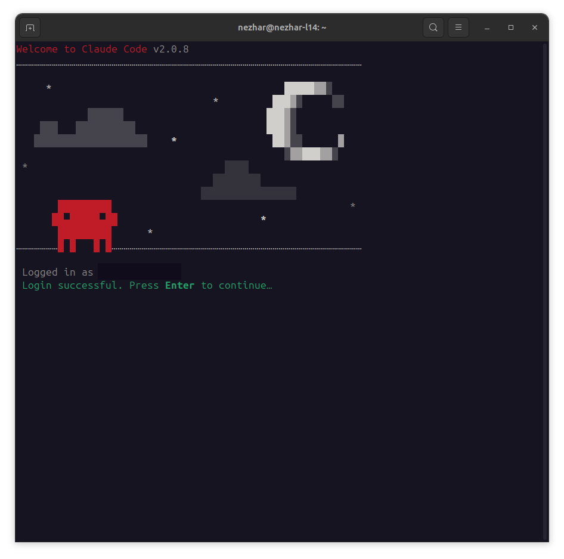

# Claude Container

A Docker container with Claude Code pre-installed and ready to use.

This container includes all necessary dependencies and provides an easy way to run Claude Code in an isolated environment.

An optional proxy can be enabled to track all the requests made by Claude Code in a local SQLite database.

## Docker Hub

Images available on Docker Hub: [nezhar/claude-container](https://hub.docker.com/r/nezhar/claude-container) and [nezhar/claude-proxy](https://hub.docker.com/r/nezhar/claude-proxy)

## Compatibility Matrix

**Latest Release:** 1.2.1 (Claude Code 2.0.13)

| Container Version | Claude Code Version |
|-------------------|---------------------|
| 1.0.x             | 1.0.x               |
| 1.1.x             | 2.0.x               |
| 1.2.x             | 2.0.x               |

## Quick Start

### Using the Helper Script (Recommended)

The easiest way to run Claude Container is using the provided bash script. Download and install it with:

```bash
# Download the script directly from GitHub
curl -o ~/.local/bin/claude-container https://raw.githubusercontent.com/nezhar/claude-container/main/bin/claude-container

# Make it executable
chmod +x ~/.local/bin/claude-container

# Run Claude Code
claude-container
```

Make sure `~/.local/bin` is in your PATH. Alternatively, install to `/usr/local/bin`:

```bash
# Download and install system-wide (requires sudo)
sudo curl -o /usr/local/bin/claude-container https://raw.githubusercontent.com/nezhar/claude-container/main/bin/claude-container
sudo chmod +x /usr/local/bin/claude-container
```

The script handles all Docker configuration automatically and supports additional features like API logging. Run with `--help` to see all available options:

```bash
claude-container --help
```

### Using Docker Compose

Create a `compose.yml` file as provided in the example folder. 
```bash
docker compose run claude-code claude
```

You will need to login for the first time, afterwards your credentials and configurations will be stored inside a bind mount volume, make sure this stays in your `.gitignore`.

### Using Docker directly


```bash
docker run --rm -it -v "$(pwd):/workspace" -v "$HOME/.config/claude-container:/claude" -e "CLAUDE_CONFIG_DIR=/claude" nezhar/claude-container:latest claude
```

This will store the credentials in `$HOME/.config/claude-container` and will be able to reuse them after the first login.

## How does the authentication work

When you run the container for the first time, you'll go through the following authentication steps:

1. **Choose Color Schema**: Select your preferred terminal color scheme

   

2. **Select Login Method**: Choose between Subscription or Console login (this example uses Subscription)

   

3. **Generate Token**: Open the provided URL in your browser to generate an authentication token, then paste it into the prompt

   

4. **Success**: You're authenticated and ready to use Claude Code

   

## Integration with Existing Projects

To integrate Claude Container into an existing Docker Compose project, create a `compose.override.yml` file:

```yaml
services:
  claude-code:
    image: nezhar/claude-container:latest
    volumes:
      - ./workspace:/workspace
      - ./claude-config:/claude
    environment:
      CLAUDE_CONFIG_DIR: /claude
    profiles:
      - tools
```

Then run Claude Code with:

```bash
# Using profiles to avoid starting by default
docker compose --profile tools run claude-code claude
```

This approach keeps Claude Code separate from your main application services while allowing easy access when needed.

## API Request Logging Proxy

This repository includes an optional logging proxy that captures all Anthropic API requests and responses to a SQLite database. This is useful for:

- Debugging API interactions
- Monitoring token usage and costs
- Analyzing request/response patterns
- Building custom analytics tools

### Running with Docker

**Run Claude Container directly:**
```bash
docker run --rm -it \
  -v "$(pwd):/workspace" \
  -v "$HOME/.config/claude-container:/claude" \
  -e "CLAUDE_CONFIG_DIR=/claude" \
  nezhar/claude-container:latest claude
```

**Run with logging proxy:**
```bash
# 1. Create a Docker network
docker network create claude-network

# 2. Start the proxy container
docker run -d --name claude-proxy \
  --network claude-network \
  -v "$(pwd)/proxy-data:/data" \
  -p 8080:8080 \
  nezhar/claude-proxy:latest

# 3. Run Claude Code (configured to use the proxy)
docker run --rm -it \
  --network claude-network \
  -v "$(pwd):/workspace" \
  -v "$HOME/.config/claude-container:/claude" \
  -e "CLAUDE_CONFIG_DIR=/claude" \
  -e "ANTHROPIC_BASE_URL=http://claude-proxy:8080" \
  nezhar/claude-container:latest claude

# 4. Cleanup when done
docker stop claude-proxy
docker rm claude-proxy
docker network rm claude-network
```

### Proxy Configuration

The proxy supports the following environment variables:

- `PROXY_PORT`: Port to listen on (default: `8080`)
- `TARGET_API_URL`: Target API URL (default: `https://api.anthropic.com`)
- `DB_PATH`: SQLite database path (default: `/data/requests.db`)
