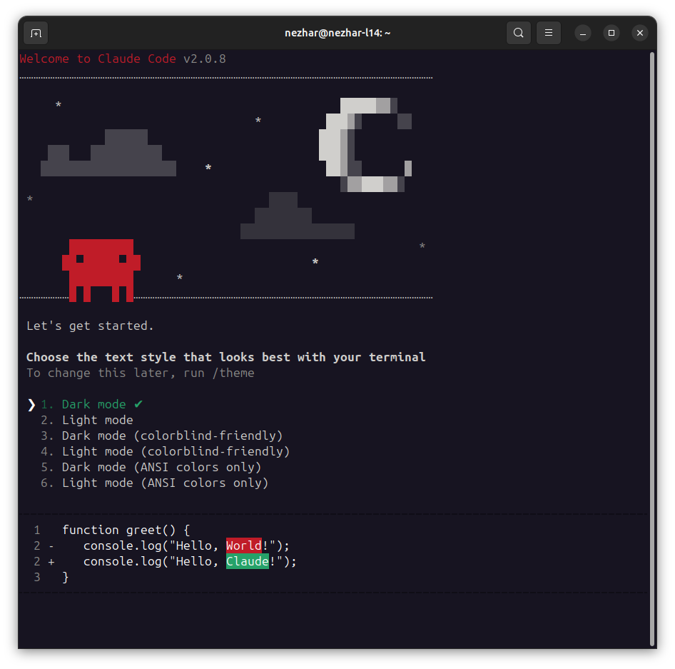
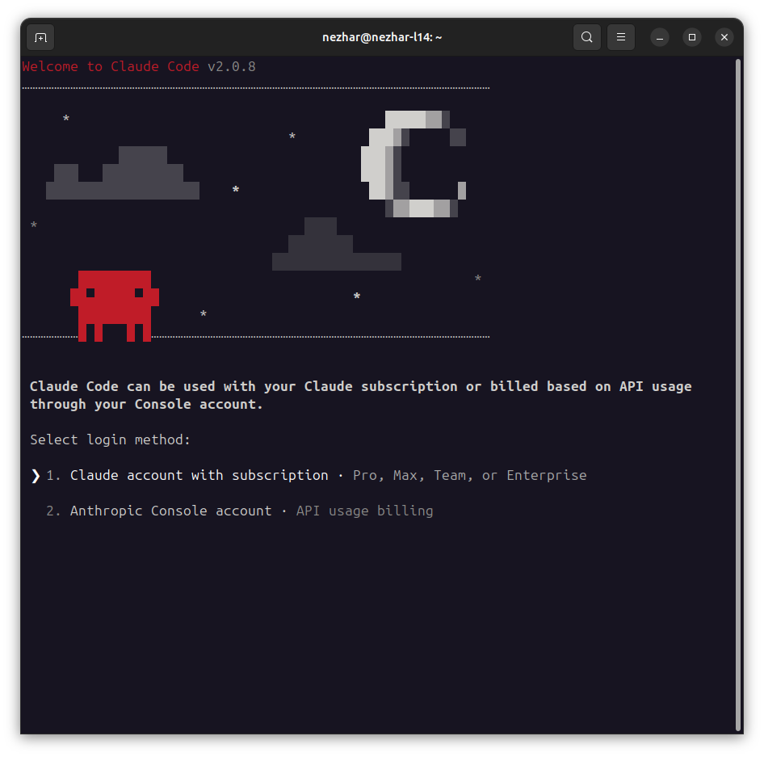
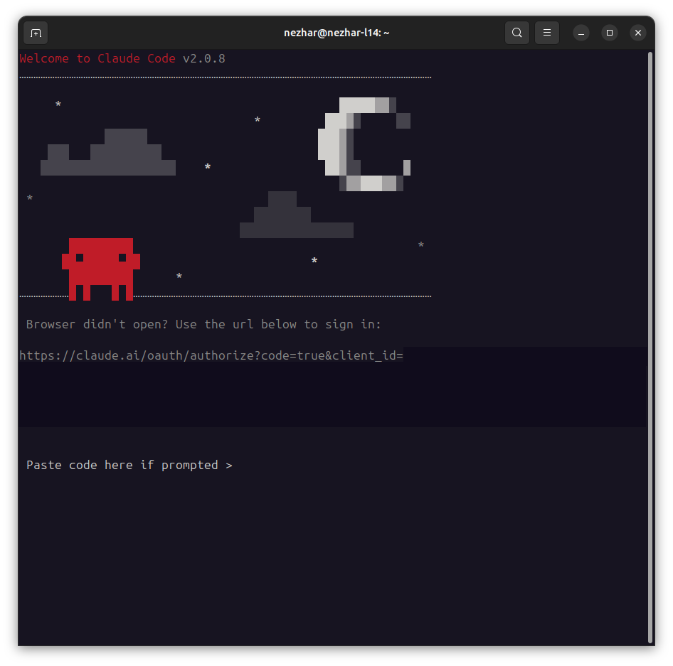
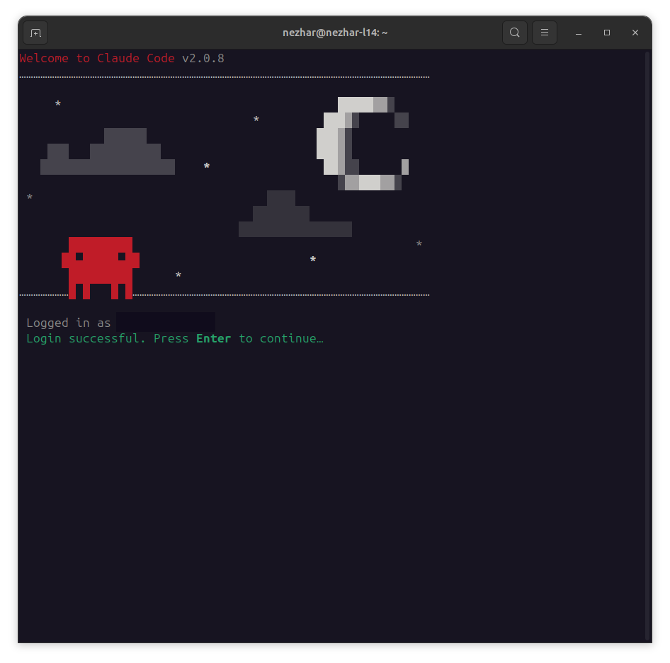

# Claude Container

A Docker container with Claude Code pre-installed and ready to use.

This container includes all necessary dependencies and provides an easy way to run Claude Code in an isolated environment.

An optional proxy can be enabled to track all the requests made by Claude Code in a local SQLite database.

## Available Images

Three Docker images are available on Docker Hub, all released with matching version tags:

| Image | Purpose | Base |
|-------|---------|------|
| [nezhar/claude-container](https://hub.docker.com/r/nezhar/claude-container) | Main container with Claude Code CLI pre-installed | Node.js 22 Alpine |
| [nezhar/claude-proxy](https://hub.docker.com/r/nezhar/claude-proxy) | Optional HTTP proxy that logs all API requests to SQLite | Python 3.12 Alpine |
| [nezhar/claude-datasette](https://hub.docker.com/r/nezhar/claude-datasette) | Optional web UI for visualizing and querying logged requests | Datasette + plugins |

### Architecture Overview

When using all three images together, the request flow looks like this:

```
┌─────────────────┐      ┌──────────────────┐      ┌─────────────────────┐
│ claude-container│─────▶│  claude-proxy    │─────▶│  api.anthropic.com  │
│  (Claude Code)  │      │   (HTTP Proxy)   │      │   (Anthropic API)   │
└─────────────────┘      └────────┬─────────┘      └─────────────────────┘
                                  │
                                  ▼
                         ┌─────────────────┐
                         │  requests.db    │
                         │   (SQLite)      │
                         └────────┬────────┘
                                  │
                                  ▼
                         ┌─────────────────┐
                         │claude-datasette │
                         │   (Web UI)      │
                         └─────────────────┘
                         http://localhost:8001
```

**Standalone Usage:**
- Use **claude-container** alone for basic Claude Code functionality
- Add **claude-proxy** when you need API request logging
- Add **claude-datasette** when you want to visualize and analyze logs

## Compatibility Matrix

**Latest Release:** 1.6.12 (Claude Code 2.1.69)

| Container Version | Claude Code Version |
|-------------------|---------------------|
| 1.0.x             | 1.0.x               |
| 1.1.x             | 2.0.x               |
| 1.2.x             | 2.0.x               |
| 1.3.x             | 2.0.x               |
| 1.4.x             | 2.0.x               |
| 1.5.x             | 2.1.x               |
| 1.6.x             | 2.1.x               |

## Quick Start

### Installing from this Repository (Recommended)

This fork ships its own Ubuntu-based container image, so install from a checkout
rather than pulling from Docker Hub:

```bash
git clone git@github.com:fughilli/claude-container.git
cd claude-container
./install.sh
```

The installer:

- copies the launcher to `~/.local/bin/claude-container`,
- installs bash completions to `~/.local/share/bash-completion/completions/`,
- builds the container image from `claude-code/` and tags it with the version
  the launcher expects (shadowing the Docker Hub image of the same name).

It is idempotent — re-running it is also the update path after `git pull` or
after editing `claude-code/` (the rebuild is cached, so unchanged layers cost
nothing). See `./install.sh --help` for options (`--system` for
`/usr/local/bin`, `--no-build`, custom directories).

Avoid `claude-container --pull` with this fork: it would replace the locally
built image with the upstream Docker Hub one.

### Using the Helper Script (upstream image)

The easiest way to run Claude Container is using the provided bash script. Download and install it with:

```bash
# Download the script directly from GitHub
curl -o ~/.local/bin/claude-container https://raw.githubusercontent.com/nezhar/claude-container/main/bin/claude-container

# Make it executable
chmod +x ~/.local/bin/claude-container

# Run Claude Code
claude-container
```

Make sure `~/.local/bin` is in your PATH. Alternatively, install to `/usr/local/bin`:

```bash
# Download and install system-wide (requires sudo)
sudo curl -o /usr/local/bin/claude-container https://raw.githubusercontent.com/nezhar/claude-container/main/bin/claude-container
sudo chmod +x /usr/local/bin/claude-container
```

The script handles all Docker configuration automatically and supports additional features like API logging. Run with `--help` to see all available options:

```bash
claude-container --help
```

#### Optional: Enable Tab Completion

To enable bash tab completion for the `claude-container` command:

```bash
# Download and install completion script
mkdir -p ~/.local/share/bash-completion/completions
curl -o ~/.local/share/bash-completion/completions/claude-container https://raw.githubusercontent.com/nezhar/claude-container/main/completions/claude-container

# Reload your shell or start a new terminal session
source ~/.bashrc
```

Once installed, you can use tab completion with `claude-container --<TAB>` to see all available options

#### Updating to the Latest Version

To update to the latest version, simply re-download the helper script and completions:

```bash
# Update helper script (user install)
curl -o ~/.local/bin/claude-container https://raw.githubusercontent.com/nezhar/claude-container/main/bin/claude-container

# Or for system-wide install
sudo curl -o /usr/local/bin/claude-container https://raw.githubusercontent.com/nezhar/claude-container/main/bin/claude-container

# Update completions (if installed)
curl -o ~/.local/share/bash-completion/completions/claude-container https://raw.githubusercontent.com/nezhar/claude-container/main/completions/claude-container

# Verify the new version
claude-container --version
```

The helper script will automatically pull the latest Docker images when needed.

### Workspace Overlay

The base `claude-container` image is shared across all workspaces. To layer
project-specific state on top of it **persistently**, create a
`.claude-container-overlay/` directory at your workspace root:

```
.claude-container-overlay/
├── Dockerfile      # build fragment appended to the base image
├── overlay.json    # structured runtime config (ports, ...)
└── skills/<name>/  # skills proposed from inside the container (see below)
```

All three parts are optional — create only what you need, and commit the
directory to the repo if the whole team should share it.

**`Dockerfile`** is a fragment (no `FROM` line) that the launcher appends to the
base image, building a workspace-local image tagged
`claude-container-overlay:<hash>` (content-addressed over the base image tag
plus the build inputs). Switching branches with different overlays just switches
images — no rebuild if you've used that overlay before. The overlay directory is
the docker build context, so the fragment can `COPY` files placed next to it.

```dockerfile
# .claude-container-overlay/Dockerfile
# 2026-06-25: ffmpeg for the video pipeline tests
RUN apt-get update && apt-get install -y --no-install-recommends \
        ffmpeg \
    && rm -rf /var/lib/apt/lists/*
```

**`overlay.json`** holds structured runtime configuration — data the launcher
reads at `docker run` time rather than baking into the image: fixed port
forwarding and named services (see the next section for the latter):

```json
{
  "ports": ["8080:8080", "127.0.0.1:3000:3000", "9000:9000/udp"],
  "services": {"dashboard": 8099}
}
```

Each `ports` entry is passed straight to `docker run -p`, so any value Docker
accepts works (`host:container`, `ip:host:container`, a bare container port, or
a `/udp` suffix). `overlay.json` and `skills/` are excluded from the image hash,
so changing ports, services, or skills never triggers a rebuild.

**Legacy form:** a single `.claude-container-overlay` *file* (a Dockerfile
fragment with `# claude-container:port <mapping>` directive comments) is still
supported, but the directory form is preferred — the launcher prints a migration
hint when it sees one, and the bundled `container-overlay` skill teaches Claude
to migrate it.

### Named Services

Fixed `"ports"` mappings collide as soon as two containers want the same host
port — the moment you run one container per git worktree, they stomp on each
other. Named services solve this: each container publishes exactly **one**
in-container mux (`svc-mux`, baked into the image) on an **ephemeral** host
port, and any number of in-container services are tunneled through it by name.
Declare them in `overlay.json`:

```json
{ "services": {"dashboard": 8099, "api": 8080, "web-tls": {"port": 8443, "tls": true}} }
```

A bare number declares a plain-HTTP service; the extended `{"port": N,
"tls": true}` form marks a TLS server. TLS can't ride the name-based HTTP
routing, so for those the dashboard and `--services` instead render a
clickable `https://127.0.0.1:<port>/` link through an automatically allocated
raw TCP forward (expect the self-signed-certificate warning; the port is
stable while the router runs).

A small host-side daemon, `claude-container-router` (started automatically at
launch), gives every instance's services stable names:

| Access | Form |
|---|---|
| Browser, zero setup | `http://dashboard.myrepo.claude.localhost/` |
| Browser, via the DNS server | `http://dashboard.myrepo.claude/` |
| Path form | `http://127.0.0.1:8484/myrepo/dashboard/...` |
| Index of everything | `http://127.0.0.1:8484/` |
| Raw TCP (non-HTTP) | `claude-container --service-port myrepo/dashboard` → prints a host port |

The portless forms work because the router binds port 80 in addition to its
primary port (8484) whenever it can: out of the box on macOS (unprivileged
low-port binds are allowed since 10.14 — but only on the wildcard address, so
the router falls back to a wildcard listener that drops non-loopback peers)
and on Linux after `sudo sysctl -w net.ipv4.ip_unprivileged_port_start=80`
(persist it in `/etc/sysctl.d/` to survive reboots). If port 80 is unavailable — e.g. a local
nginx owns it — the router logs a note and everything works with `:8484`
appended; `claude-container --services` always prints the exact working URLs.
HTTPS is not terminated (that would need a locally trusted CA à la `mkcert`);
plain `http://` on loopback is a secure context in browsers anyway.

The instance name is the workspace directory's basename (`myrepo` above; a
short path hash is appended only when two different workspaces share a
basename). The launcher prints it at startup, and `claude-container --services`
lists all running instances and their services.

Because each container's mux resolves service names by re-reading its
workspace's `overlay.json` **on every connection**, Claude can build a new
dashboard mid-session, add one line to `overlay.json`, and hand you a working
URL — no container restart, no launcher restart, no port hunting. The
`*.localhost` host form needs no DNS setup at all (browsers and systemd
resolve `*.localhost` to `127.0.0.1` themselves).

The router also runs a tiny DNS server (default `127.0.0.1:8453/udp`) that
answers `A → 127.0.0.1` for `*.claude`, for the shorter host form:

- **macOS** — create `/etc/resolver/claude` containing:

  ```
  nameserver 127.0.0.1
  port 8453
  ```

- **Linux (systemd-resolved)** — resolved can't query a non-53 port; either run
  the router's DNS on port 53 (`CLAUDE_ROUTER_DNS_PORT=53`, needs
  root/`CAP_NET_BIND_SERVICE`, then `resolvectl dns lo 127.0.0.1` +
  `resolvectl domain lo '~claude'`), or point a local dnsmasq at it
  (`server=/claude/127.0.0.1#8453`). Or just use the `*.claude.localhost`
  form, which needs nothing.

Router management: `--router-start`, `--router-stop`, `--router-status`,
`--router-logs`. Configuration via environment variables:
`CLAUDE_ROUTER_HTTP_PORT` (default 8484), `CLAUDE_ROUTER_HTTP_ALT_PORTS`
(best-effort extra listeners, default `80`), `CLAUDE_ROUTER_DNS_PORT` (8453),
`CLAUDE_ROUTER_DOMAIN` (`claude`), `CLAUDE_ROUTER_BIND` (`127.0.0.1`). State
lives in `~/.config/claude-container/` (`services/` registrations,
`router.log`, `router.pid`). Everything binds to loopback only.

When to still use `"ports"`: something outside the machine must reach in on a
well-known port, a config hardcodes a port number, or the protocol is UDP.

### Permissions

The container is an isolated sandbox (only the workspace and config dir are
bind-mounted), so Claude's interactive permission prompts just get in the way. The
launcher disables them on every run by ensuring the config dir's `settings.json`
contains:

```json
{ "permissions": { "defaultMode": "bypassPermissions" } }
```

This setting (merged into any existing `settings.json`, preserving your other
keys) applies to **every** `claude` launch in the container — including explicit
ones like `claude-container claude --resume`. It is used instead of the
`--dangerously-skip-permissions` flag, whose interactive acceptance screen stopped
persisting in recent Claude Code versions and would silently fall back to
prompting. To re-enable prompts, remove that key from
`~/.config/claude-container/config/settings.json`.

### Bundled Skills

The image ships with Claude Code [skills](https://code.claude.com/docs/en/skills)
baked in (under `claude-code/skills/`) so Claude knows how to use the
container-specific features in **every** workspace, with no per-project setup:

- **`container-overlay`** — how to persist tooling and declare port mappings via
  the `.claude-container-overlay/` directory.
- **`container-services`** — how to expose in-container servers as named
  services (and migrate old `"ports"` entries to them; see Named Services
  above).
- **`container-tmux`** — how to drive the tmux session when running with `--tmux`
  (see below).
- **`container-skills`** — how to propose new skills from inside the container
  (see the next section).

The skills are copied into Claude's skills directory automatically when the
container starts (the entrypoint deploys them from `/opt/claude-container/skills`,
refreshed on each launch so they always match the image version). To add or edit
a bundled skill, change the files under `claude-code/skills/` and rebuild the
image.

### Skill Proposals and Sharing

Beyond the baked-in skills, skills can flow from a single session out to every
claude-container project on the machine, through three tiers:

1. **Workspace skills** — `<workspace>/.claude-container-overlay/skills/<name>/SKILL.md`.
   Claude proposes a skill from inside the container by writing it here (the
   bundled `container-skills` skill teaches it how and when). Workspace skills
   are always deployed for their own project at the next launch, and can be
   committed to the repo along with the rest of the overlay.
2. **User-wide skills** — `~/.config/claude-container/user-skills/<name>/`.
   Adopt a workspace skill into this set to offer it to every claude-container
   instance on the system (the adopting project accepts it automatically):

   ```bash
   claude-container --skills-adopt <name>
   ```

3. **Per-project choices** — when a launch finds a user-wide skill the current
   project hasn't decided on, it prompts once (**y**es / **n**o / **s**kip).
   Yes/no answers are sticky, stored per project under
   `~/.config/claude-container/skill-choices/`; skip asks again next launch.
   Non-interactive launches never prompt — undecided skills just stay undeployed
   until an interactive launch (or `--skills-accept`) decides them.

At every launch the effective set — workspace skills plus accepted user-wide
skills — is synced into the config dir's `skills/` directory. A manifest file
(`skills/.claude-container-managed`) tracks which entries the launcher manages,
so rejected or removed skills are cleaned up without touching skills you placed
there by hand or the image-bundled ones. Because the config dir is shared, the
sync reflects the most recently launched project; concurrently running
containers for projects with *different* accepted sets will see the last
launcher's set.

Manage everything with:

| Command | Effect |
|---|---|
| `claude-container --skills` | List user-wide + workspace skills and this project's choices |
| `claude-container --skills-adopt <name>` | Copy a workspace skill into the user-wide set |
| `claude-container --skills-accept <name>` | Include a user-wide skill in this project (sticky) |
| `claude-container --skills-reject <name>` | Exclude a user-wide skill from this project (sticky) |
| `claude-container --skills-reset` | Forget this project's choices (prompts again next launch) |
| `claude-container --skills-drop <name>` | Remove a skill from the user-wide set |

### Running Inside tmux

Pass `--tmux` to run Claude inside a [tmux](https://github.com/tmux/tmux) session:

```bash
claude-container --tmux
```

This lets you open additional shells in the same container (with your tmux
prefix, e.g. `prefix + c`) and run commands directly — without going through
Claude — and lets Claude start and observe long-running processes in their own
windows via `tmux` / `tmux send-keys`. The top-level session has the canonical
name **`claude`**, and the host's `~/.tmux.conf` is mounted in when present (so
your keybindings and prefix carry over). The bundled `container-tmux` skill
documents the workflow for Claude.

### Using Docker Compose

Create a `compose.yml` file as provided in the example folder. 
```bash
docker compose run claude-code claude
```

You will need to login for the first time, afterwards your credentials and configurations will be stored inside a bind mount volume, make sure this stays in your `.gitignore`.

### Using Docker directly


```bash
docker run --rm -it -v "$(pwd):/workspace" -v "$HOME/.config/claude-container:/claude" -e "CLAUDE_CONFIG_DIR=/claude" nezhar/claude-container:latest claude
```

This will store the credentials in `$HOME/.config/claude-container` and will be able to reuse them after the first login.

## How does the authentication work

When you run the container for the first time, you'll go through the following authentication steps:

1. **Choose Color Schema**: Select your preferred terminal color scheme

   

2. **Select Login Method**: Choose between Subscription or Console login (this example uses Subscription)

   

3. **Generate Token**: Open the provided URL in your browser to generate an authentication token, then paste it into the prompt

   

4. **Success**: You're authenticated and ready to use Claude Code

   

## Integration with Existing Projects

To integrate Claude Container into an existing Docker Compose project, create a `compose.override.yml` file:

```yaml
services:
  claude-code:
    image: nezhar/claude-container:latest
    volumes:
      - ./workspace:/workspace
      - ./claude-config:/claude
    environment:
      CLAUDE_CONFIG_DIR: /claude
    profiles:
      - tools
```

Then run Claude Code with:

```bash
# Using profiles to avoid starting by default
docker compose --profile tools run claude-code claude
```

This approach keeps Claude Code separate from your main application services while allowing easy access when needed.

## Git Worktrees

Running `claude-container` inside a [linked git worktree](https://git-scm.com/docs/git-worktree) just works. A worktree's `.git` is a pointer file into the main checkout's `.git` directory, which lives outside the workspace — so mounting the worktree alone would leave git in the container with a dangling pointer (`fatal: not a git repository`). The launcher detects this and additionally bind-mounts the main repository's `.git` directory at the path the pointer expects inside the container.

This pairs naturally with named services: run one container per worktree and they share the main repository's `.git` exactly as concurrent worktrees do on the host, while their services stay separately addressable per instance.

## API Request Logging Proxy

This repository includes an optional logging proxy that captures all Anthropic API requests and responses to a SQLite database. This is useful for:

- Debugging API interactions
- Monitoring token usage and costs
- Analyzing request/response patterns
- Building custom analytics tools

### Running with Docker

**Run Claude Container directly:**
```bash
docker run --rm -it \
  -v "$(pwd):/workspace" \
  -v "$HOME/.config/claude-container:/claude" \
  -e "CLAUDE_CONFIG_DIR=/claude" \
  nezhar/claude-container:latest claude
```

**Run with logging proxy:**
```bash
# 1. Create a Docker network
docker network create claude-network

# 2. Start the proxy container
docker run -d --name claude-proxy \
  --network claude-network \
  -v "$(pwd)/proxy-data:/data" \
  -p 8080:8080 \
  nezhar/claude-proxy:latest

# 3. Run Claude Code (configured to use the proxy)
docker run --rm -it \
  --network claude-network \
  -v "$(pwd):/workspace" \
  -v "$HOME/.config/claude-container:/claude" \
  -e "CLAUDE_CONFIG_DIR=/claude" \
  -e "ANTHROPIC_BASE_URL=http://claude-proxy:8080" \
  nezhar/claude-container:latest claude

# 4. Cleanup when done
docker stop claude-proxy
docker rm claude-proxy
docker network rm claude-network
```

### Proxy Configuration

The proxy supports the following environment variables:

- `PROXY_PORT`: Port to listen on (default: `8080`)
- `TARGET_API_URL`: Target API URL (default: `https://api.anthropic.com`)
- `DB_PATH`: SQLite database path (default: `/data/requests.db`)

## Data Visualization with Datasette

This repository includes a Datasette container for exploring and visualizing the API request logs captured by the proxy. Datasette provides a web-based interface to explore your SQLite database with filtering, sorting, and export capabilities.

### Features

- **Browse Request Logs**: View all API requests with filtering and sorting
- **JSON Visualization**: Pretty-print JSON request/response bodies
- **Analytics**: Analyze request patterns, response times, and error rates
- **Export Data**: Export filtered results to CSV, JSON, or Excel
- **SQL Queries**: Run custom SQL queries against your data

### Running with Datasette

When using Docker Compose, you can add the Datasette service to visualize your proxy data:

```yaml
services:
  claude-proxy:
    image: nezhar/claude-proxy:latest
    ports:
      - "8080:8080"
    volumes:
      - ./proxy-data:/data

  claude-datasette:
    image: nezhar/claude-datasette:latest
    ports:
      - "8001:8001"
    volumes:
      - ./proxy-data:/data:ro
    depends_on:
      - claude-proxy

  claude-code:
    image: nezhar/claude-container:latest
    volumes:
      - ./workspace:/workspace
      - ./claude-config:/claude
    environment:
      CLAUDE_CONFIG_DIR: /claude
      ANTHROPIC_BASE_URL: http://claude-proxy:8080
    depends_on:
      - claude-proxy
```

Start the services:
```bash
docker compose up -d claude-proxy claude-datasette
docker compose run claude-code claude
```

Then access Datasette at http://localhost:8001 to explore your API request logs.

### Using Datasette

Once Datasette is running:

1. **View All Requests**: Navigate to the `request_logs` table to see all captured API requests
2. **Filter Data**: Use the faceted filters to narrow down by HTTP method, status code, etc.
3. **Examine Details**: Click on individual requests to see full headers and JSON bodies
4. **Run Queries**: Use the SQL interface to run custom analytics queries
5. **Export Results**: Export filtered data in various formats for further analysis

Example queries you might run:

```sql
-- Average response time by endpoint
SELECT path, AVG(duration_ms) as avg_duration, COUNT(*) as request_count
FROM request_logs
GROUP BY path
ORDER BY avg_duration DESC;

-- Requests with errors
SELECT timestamp, method, path, response_status, duration_ms
FROM request_logs
WHERE response_status >= 400
ORDER BY timestamp DESC;

-- Token usage over time (if captured in request_body)
SELECT
  DATE(timestamp) as date,
  SUM(json_extract(response_body, '$.usage.input_tokens')) as input_tokens,
  SUM(json_extract(response_body, '$.usage.output_tokens')) as output_tokens
FROM request_logs
WHERE json_extract(response_body, '$.usage') IS NOT NULL
GROUP BY date
ORDER BY date DESC;
```
